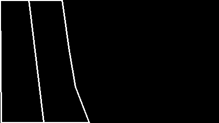
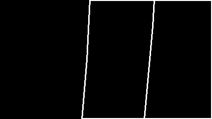
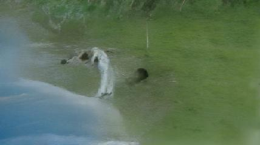
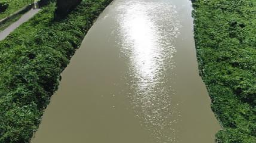
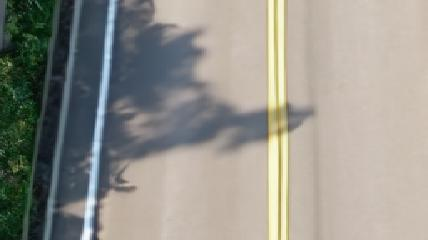

# 競賽報告

## 環境

- 作業系統：Ubuntu
- 語言：Python
- 套件（函式庫）: PyTorch、NumPy、OpenCV、mpi4py、dlib
- 預訓練模型：PITI
- 額外資料集：無

## 演算法與模型架構

建議字數：300~1200 字。
內容規定：說明演算法設計、模型架構與模型參數，包括可能使用的特殊處理方式。

### PITI（Pretraining is All You Need for Image-to-Image Translation）

- 演算法設計

  使用了一種基於預訓練擴散模型的通用框架來進行圖像到圖像的轉換。主要策略包括：

  - 預訓練擴散模型：使用大量圖像進行預訓練，使模型能夠捕捉自然圖像的統計特性。
  - 對抗訓練：在擴散模型訓練過程中加入對抗訓練以增強紋理合成能力。
  - 標準化指導采樣：引入噪聲統計標準化以改進生成圖像質量，特別是在使用指導采樣技術時。

- 模型架構

  - 基礎擴散模型：採用 GLIDE 模型進行預訓練，生成多種圖像。
  - 任務特定的頭部編碼器：將特定轉換任務的輸入（例如分割掩膜或草圖）映射到預訓練模型的語義空間中。
  - 擴散解碼器：使用預訓練的擴散模型作為解碼器生成圖像。
  - 兩階段微調：
    - 第一階段：固定預訓練的解碼器，僅訓練任務特定的編碼器。
    - 第二階段：共同微調編碼器和解碼器以提高生成質量。

## 技術模型原創性或改良成效

建議字數：200~1200 字。
內容規定：說明演算法、模型之原創性或者改良外部資源哪一部分後所帶來之成效。

### PITI

PITI 顯著提升了影像生成的質量和多樣性，具體體現在以下幾個方面：

1. 生成質量提升：通過採用預訓練的 GLIDE 模型，PITI 能夠生成更高質量和更逼真的圖像。擴散模型在處理複雜場景時展現出優越的表現，尤其是在缺乏豐富配對訓練數據的情況下。
1. 生成過程改進：引入對抗性訓練和規範化引導抽樣，改善了擴散模型在生成過程中的質感合成和細節處理，避免了過度平滑的現象。
1. 跨任務適應性：PITI 框架展示了在多種影像轉換任務中的通用性，能夠在不同的數據集上達到領先的性能，包括 ADE20K、COCO-Stuff 和 DIODE 等挑戰性基準數據集。
1. 少樣本學習潛力：由於預訓練模型捕捉到了自然影像的多樣性，PITI 在少量訓練數據下依然能夠生成高質量的圖像，展示了其在少樣本學習中的應用前景。

## 資料分析與處理過程

建議字數：200~1500 字。
內容規定：說明對資料集的理解與後續處理或擴增的方式，例如對資料集包含的影像內容、資料可能的刪減、更正或增補。

- 資料前處理

  - 轉換為 mask 圖片

    此演算法旨在將包含白色輪廓的圖片轉換為根據不同類別進行著色的圖片。具體步驟如下：

    - 初始化變數：

      獲取圖片的尺寸（行數和列數）。
      創建一個與圖片大小相同的布林陣列 visited，用於記錄每個像素是否已被訪問。

    - 定義輔助函數：

      is_white(pixel)：檢查給定像素是否為白色（即 [255, 255, 255]）。
      bfs(x, y)：廣度優先搜索（BFS）從起始點 (x, y) 開始，遍歷所有連通的非白色像素，並將它們標記為紅色（ [255, 0, 0] ）。

    - 邊界檢查與 BFS 遍歷：

      遍歷圖片的邊界像素（即四個邊），對每個像素執行以下操作：
      檢查該像素是否為邊界像素（邊界像素指的是周圍存在白色像素的像素）。
      若不是邊界像素，則從該像素開始執行 BFS 遍歷，將所有連通的非白色像素標記為紅色。

    - 標記剩餘像素：

      根據輸入的類別標籤 label（ RI 表示河流， RO 表示道路），將未被訪問且非白色的像素著色：
      若類別為 RI，則將這些像素標記為藍色（ [0, 0, 255] ）。
      若類別為 RO，則將這些像素標記為綠色（ [0, 255, 0] ）。

    範例 1: River:

    - 輸入圖片

      

    - 輸入圖片:

      

    範例 2: Road:

    - 輸入圖片

      

    - 輸入圖片:

      

## 訓練方式

建議字數：300~1000 字。
內容規定：說明模型的訓練方法與過程。

### PITI

使用 4 個 NVIDIA RTX 6000 Ada 的 GPU 進行訓練，以加速模型訓練過程。

1. 階段一：初始模型訓練

   參數：

   - 圖像大小：64
   - 無條件概率：0
   - 學習率：3.5e-5
   - 批次大小：28
   - 採樣器：loss-second-moment
   - 學習率衰減步數：20000
   - 優化器：AdamW
   - 不微調編碼器

1. 階段二：繼續訓練

   參數：

   - 圖像大小：64
   - 無條件概率：**0.2**
   - 學習率：**2e-5**
   - 批次大小：28
   - 採樣器：loss-second-moment
   - 學習率衰減步數：20000
   - 優化器：AdamW
   - 不微調編碼器

1. 階段三：微調解碼器

   參數：

   - 圖像大小：64
   - 無條件概率：0.2
   - 學習率：2e-5
   - 批次大小：28
   - 採樣器：loss-second-moment
   - 學習率衰減步數：20000
   - 優化器：AdamW
   - **要微調編碼器**

## 結果分析與結論

建議字數：300~2500 字。
內容規定：分析所使用的模型及其成效，簡述未來可能改進的方向。分析必須附圖，可將幾個成功和失敗的例子附上並說明之。

### PITI

1. PITI 生成問題：水彩畫效果

   在生成圖片時，PITI 有時會生成出類似水彩畫效果的圖片，這與我們期望的實景照片不符。例如，下圖顯示了一個 PITI 生成的例子，其中圖像呈現出不符合要求的水彩畫風格。

   

1. PITI 生成 River 類別的圖片：反光效果

   在生成 River 類別的圖片時，PITI 通常能夠很好地再現周圍的草地和河流的細節。更令人印象深刻的是，PITI 還能夠在河流上生成反光效果，使得河流顯得更加逼真和生動。

   

1. PITI 生成的 Road 類別圖片：道路標線粗細不一

   在生成 Road 類別的圖片時，PITI 有時會出現標線粗細不一的現象。這種不一致性可能會影響道路場景的真實感，下面的圖片展示了一個標線粗細不一的例子。

   

## 程式碼

PITI 部分：https://github.com/Tianming8585/PITI
